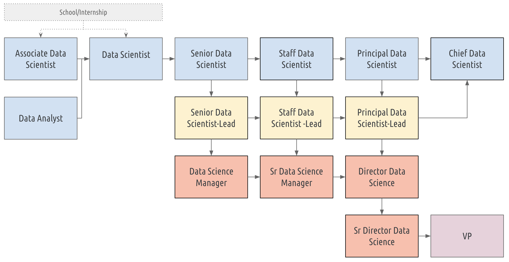

# A roadmap for Data Science careers

The documents under this repository describe a career path for data scientists in the technology industry. They were written
specifically with my experience running a data science team at Akamai.

## The need for a formal Career Path

We do not currently have any standardization of the skills, roles and responsibilities of individuals at various levels of a
data science career, neither industry wide, nor even within most organizations. This leads to significant disparity in the
titles, promotion paths, and compensation of individuals with the same skills and responsibilities, and uncertainty about ones
future at a company.

A formal career path:
* Helps managers provide guidance to their reports on how to level up.
* Helps with defining roles for hiring across the company and alignment of expectations.
* Gives Data Scientists a clear understanding and path to their future growth at the company.
* Standardization for H1 & Perm applications. Easier for applicants to be promoted while waiting for USCIS approvals.

## What is a Data Scientist?

According to the _Data Science Titling Guidelines_ from the US Office of Personnel Management,

> Data Scientist work is multifaceted and requires talent from interdisciplinary backgrounds. Data Scientists are defined as practitioners
> with sufficient knowledge in the areas of business needs, domain knowledge, analytical skills, and software and systems engineering to
> manage the end-to-end data processes in the data life cycle

More casually according to [@josh_willis](https://twitter.com/josh_wills/status/198093512149958656):

> Data Scientist (n.): Person who is better at statistics than any software engineer and better at software engineering than any statistician.

## Path overview

The image above shows an overview of the Data Scientist Career Path and is described in more detail in this section with links to individual roles.
* An individual coming out of School or an Internship may start their career as either an [Associate Data Scientist](associate-data-scientist/README.md), or a [Data Scientist](data-scientist/README.md)
  depending on their skills.
* An Associate Data Scientist may be promoted to a Data Scientist.
* Additionally, a Data Analyst may make a shift into Data Science and be promoted to Data Scientist.
* A Data Scientist may be promoted to [Senior Data Scientist](senior-data-scientist/README.md).
* A Senior Data Scientist, may be promoted to [Staff Data Scientist](staff-data-scientist/README.md), and then promoted to [Principal Data Scientist](principal-data-scientist/README.md).
* Additionally, Senior, Staff, and Principal Data Scientists may take on [Lead](lead-manager/README.md) responsibilities as a step towards management. The promotion paths
  for Leads mirrors that for their non-lead counterparts.
* A Principal Data Scientist may be promoted to [Chief Data Scientist](chief-data-scientist/README.md). There is no Lead Chief Data Scientist.
* A Lead may choose to make a lateral shift into management as follows:
   * A Lead Senior Data Scientist may become a [Data Science Manager](lead-manager/README.md).
   * A Lead Staff Data Scientist may become a [Senior Data Science Manager](lead-manager/README.md).
   * A Lead Principal Data Scientist may become a [Director of Data Science](lead-manager/README.md).
* A Director of Data Science may be promoted to [Senior Director of Data Science](lead-manager/README.md).
* A Senior Director of Data Science may be promoted to Vice President which is a peer level of the [Chief Data Scientist](chief-data-scientist/README.md).

## Key Points

* Degree requirements are broad, and apart from traditional *CS/EE*, also includes specializations like __Biology__, __Physics__, __Chemistry__, __Economics__, __Anthropology__, __Sociology__, __Psychology__ where data analysis is key.
* Data Scientist and higher requires experience in *one* statistical programming language like __R__, __Python__, __Julia__, __Octave__, etc., and __SQL__ or equivalent.
* Ability to __communicate__ the results of analyses & methodology to technical & non-technical audiences, internal & customer, electronically & in-person.
* Senior positions require participation in strategic planning initiatives & providing thought leadership.
